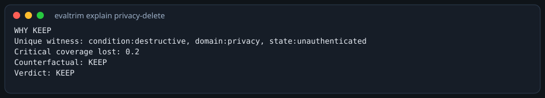
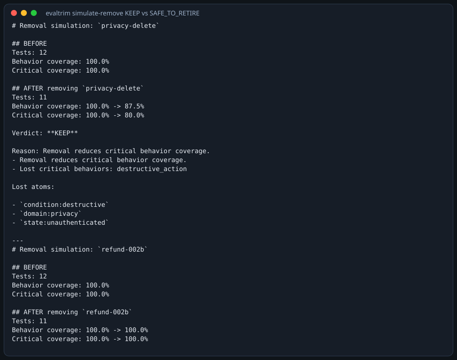
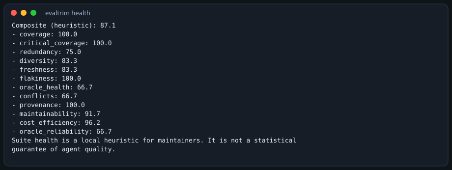
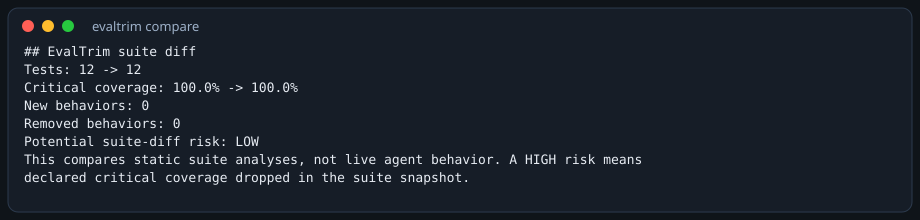
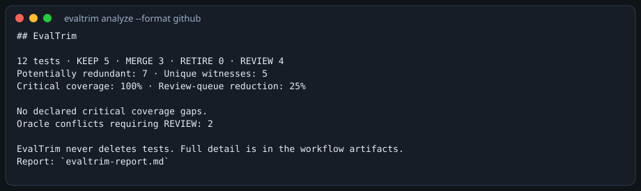

# EvalTrim

Prove which AI-agent evals are worth keeping.

EvalTrim is a local-first evaluation control plane for AI agents that evaluates not only agent behavior, but the evaluation suite itself. It never deletes tests. Recommendations are `KEEP` / `MERGE` / `REVIEW` / `RETIRE`, each with an evidence ledger.

[](LICENSE)
[](pyproject.toml)


## Why EvalTrim?

AI-agent eval suites grow quickly. Redundant, stale, flaky, and conflicting tests accumulate. Most tools evaluate the agent. EvalTrim also analyzes which tests are worth keeping.

## The key idea

Similarity creates candidates. Behavioral evidence determines safety. Counterfactual removal verifies what would actually be lost.





## 30-second demo

```bash
git clone https://github.com/lowjieseng1810/evaltrim.git
cd evaltrim
python3 -m pip install -e ".[dev]"
evaltrim analyze examples/demo_suite.yaml
```

Real output on the constructed demo suite (not production traffic):

```
12 tests analyzed
5 recommended KEEP
3 MERGE
0 RETIRE
4 REVIEW
Critical behavior coverage: 100.0%
```

```bash
evaltrim explain privacy-delete --suite examples/demo_suite.yaml
evaltrim simulate-remove examples/demo_suite.yaml privacy-delete
```

`privacy-delete` → **KEEP** (unique destructive/privacy witness; critical coverage would drop 100% → 80%).  
`refund-002b` → **MERGE** (near-duplicate; coverage stays 100%). Still not auto-deleted.

## What it does

### Evaluate

Grade agent outputs: exact/regex/JSON, tools, trajectories, scenarios, and statistics.

### Detect

Catch regressions, drift, flakes (including `ENVIRONMENTAL`), and oracle conflicts. A provider error is not a confirmed model regression.

### Explain

Show why a test is a unique witness and what counterfactual removal would lose.

### Optimize

Shrink the suite under coverage, cost, and time constraints (portfolio / Pareto, evaluation debt).

### Maintain

Emit evidence-backed `KEEP` / `MERGE` / `REVIEW` / `RETIRE`. EvalTrim never rewrites the suite file.

## What makes it different

- **Unique behavioral witnesses** — the only remaining test for a behavior, boundary, requirement, or failure family
- **Counterfactual removal** — simulate deleting a test before anyone deletes it
- **Suite health / evaluation debt** — heuristics for maintainers, not scores you can game
- **Evidence-backed recommendations** — overlap, witness loss, and a removal verdict on every decision
- **Portfolio optimization** — greedy + 1-opt subset under cost / time / count budgets
- **Production failure compression** — cluster failures into candidate tests; nothing is auto-inserted

## Measured results

**Constructed / labeled benchmark** — not production accuracy. Ground truth was not rewritten to chase scores. Details: [docs/benchmark.md](docs/benchmark.md).

| Metric | Value |
| --- | --- |
| Unique-witness precision | 1.0 |
| Unique-witness recall | 1.0 |
| Critical witness recall | 1.0 |
| False critical witnesses | 0 |
| Retirement safety | 1.0 |
| Critical coverage | 1.0 |
| 10k cold runtime | 54.7049s (`EVALTRIM_NO_CACHE=1`) |
| Incremental 10k / 5 changed | 2.0613s (pair cache already populated; empty-cache ~10.4s) |

## Competitive position

EvalTrim reaches parity on measured common evaluation dimensions and adds a dedicated evaluation-suite intelligence layer for witness analysis, counterfactual maintenance, and suite optimization.

Some competitor dimensions remain UNMEASURED or NOT DIRECTLY COMPARABLE. That is not a win.

[docs/competitive-results.md](docs/competitive-results.md)

## GitHub / CI

```yaml
- uses: actions/checkout@v4
- uses: actions/setup-python@v5
  with: { python-version: "3.12" }
- run: pip install .
- run: evaltrim analyze examples/demo_suite.yaml --format github
```

Full workflow: [`.github/workflows/evaltrim.yml`](.github/workflows/evaltrim.yml)

## Installation

```bash
python3 -m pip install -e ".[dev]"
evaltrim doctor
```

Python 3.11+. Offline by default.

## Screenshots

From `evaltrim` 1.0.0 on `examples/demo_suite.yaml`.






## Architecture

```
CLI → Evaluation model → Traces / history → Behavior graph → Intelligence → Evidence → Reports / CI
```

## Privacy / local-first

No hosted backend. No telemetry by default. Optional LLM / embeddings only when you enable them. [docs/privacy.md](docs/privacy.md)

## Limitations

- Local sandbox is not VM isolation
- LLM judge is optional and provider-dependent
- Semantic similarity remains heuristic
- Some competitor dimensions remain UNMEASURED
- No hosted SaaS
- No automatic deletion

## License

[MIT](LICENSE)
