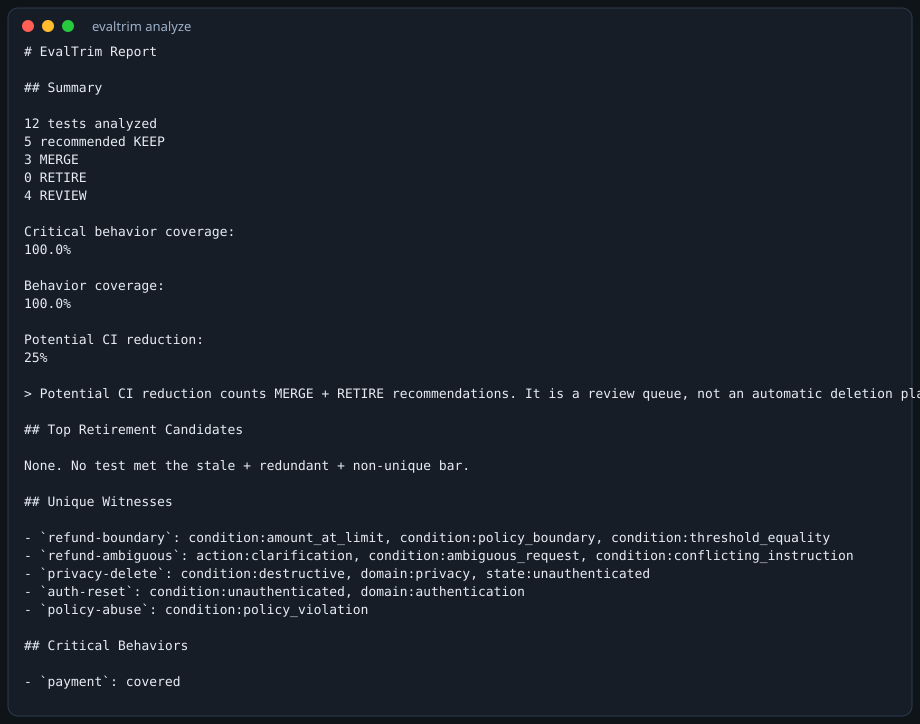
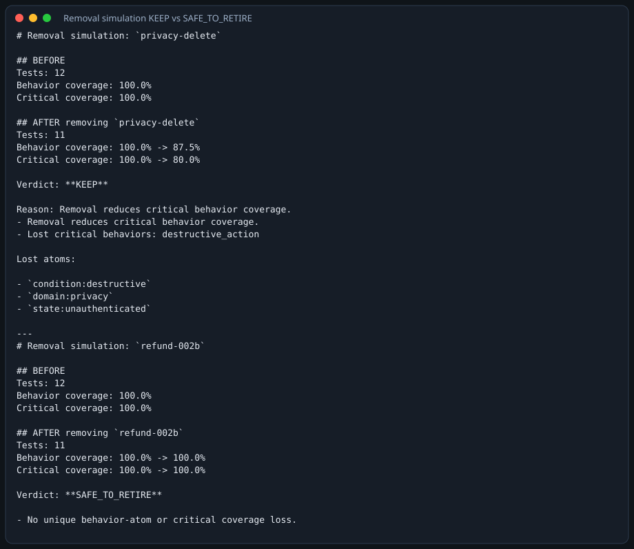
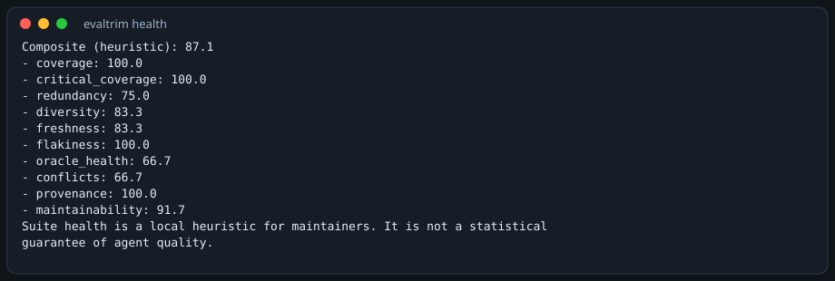
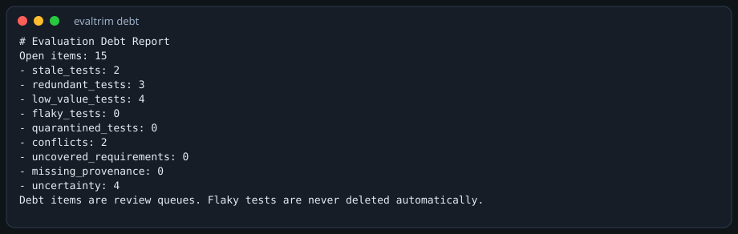
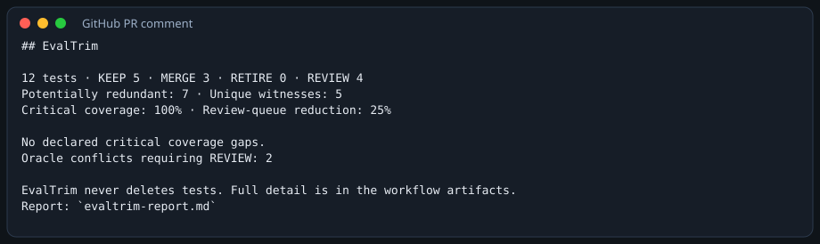

# EvalTrim

> The Evaluation Control Plane for AI Agents.

Run. Replay. Compare. Understand. Optimize. Maintain.

EvalTrim is a **local-first** CLI for AI-agent eval suites. It does not replace your agent runtime or a generic eval harness. It sits beside them and answers: which tests are unique, which are redundant, what a removal would break, and what to run after a change.

It never deletes tests. Recommendations are `KEEP` / `MERGE` / `RETIRE` / `REVIEW` / `ADD_CANDIDATE`, each with a serializable evidence ledger.

Current version: **0.6.0** (beta public API — not 1.0).

## Three layers

1. **Evaluation** — run graders against a local adapter, record, replay, experiment comparison.
2. **Regression Control** — compare recorded runs and suite snapshots, classify likely drift sources, watch files, select impacted tests, pre-commit `gate`.
3. **Evaluation Intelligence** — behavior graph, unique witnesses, counterfactual removal, suite health, evaluation debt, portfolio selection, explanations for coding agents.

EvalTrim does not only evaluate the agent. It evaluates and maintains the evaluation system itself.

## What makes it different

These are complementary to Promptfoo, LangSmith, Braintrust, and similar tools — not a claim of inventing evaluation:

- **Behavior graph** — tests as coverage over normalized behavior atoms.
- **Unique witnesses** — the only remaining test for a behavior, boundary, requirement, or failure family.
- **Counterfactual removal** — simulate deleting a test *before* anyone deletes it.
- **Suite health** and **evaluation debt** — heuristic diagnostics, not scores you can game.
- **Evidence ledger** — every recommendation carries similarity, overlap, witness loss, and removal verdict.
- **Portfolio optimization** — a explainable greedy + 1-opt subset under cost / time / count budgets.

Semantic similarity may **create candidates**. It does **not** independently authorize `RETIRE`.

## 30-second workflow

```bash
git clone <this-repo>
cd evaltrim
python3 -m pip install -e ".[dev]"
evaltrim init evals.yaml
evaltrim analyze evals.yaml
evaltrim health evals.yaml --format json
evaltrim regression examples/demo_suite.yaml examples/demo_suite.yaml --format json
evaltrim maintain evals.yaml
evaltrim explain privacy-delete --suite examples/demo_suite.yaml
evaltrim doctor
```

Use `examples/demo_suite.yaml` if you want a populated suite immediately.

## Semantic matching (honest)

| Mode | How to enable | Network |
| --- | --- | --- |
| **DEFAULT** | nothing | none — normalized tokens, n-grams, rare-token weights, behavior overlap, unique witnesses, counterfactual removal |
| **OPTIONAL EMBEDDING** | `EVALTRIM_EMBEDDINGS=1` or `config.embeddings_enabled` | none — local hashing encoder (no model download) |
| **OPTIONAL LLM** | `EVALTRIM_LLM=1` / `config.llm_enabled` plus a provider you configure | only then |

The default merge bar is **not** lowered globally. Hard negatives that share vocabulary but differ in behavior stay unmerged (refund vs refund + store credit).

## Agent-native CLI

Every important command accepts `--format json` with stable field names:

`status` · `analyze` · `regression` · `impacted-tests` · `maintain` · `health` · `debt` · `flaky` · `explain` · `benchmark` · `gate` · `doctor` · `experiment`

Exit codes: `0` ok · `2` invalid/missing input · `3` policy/strict · `4` internal.

Optional tiny MCP-style adapter (`evaltrim.mcp_adapter.dispatch`): `get_status`, `impacted_tests`, `explain`, `regression_summary`, `suggest_maintenance`. Not required. Not a platform.

## Screenshots (actual CLI output)

Generated from this repo’s demo suite. Not mocked numbers.

### Main CLI



### Unique witness (why a test is kept)


### Removal simulation (SAFE vs KEEP)



### Suite health / evaluation debt





### Regression


### GitHub PR comment (rendered from `--format github`)



### HTML report

Open [docs/images/report.html](docs/images/report.html).

## Measured quality (v0.6.0)

Command: `EVALTRIM_NO_CACHE=1 PYTHONPATH=src python3 -m evaltrim.cli benchmark benchmarks`  
No LLM. Embeddings off. Constructed suites — **not** production traffic.

| Suite | Precision | Recall | F1 | Retirement safety | Critical coverage | Suite reduction |
| --- | --- | --- | --- | --- | --- | --- |
| coding_agent | 1.0 | 1.0 | 1.0 | 1.0 | 1.0 | 46% |
| customer_support | 1.0 | 1.0 | 1.0 | 1.0 | 1.0 | 25% |
| shopping_agent | 1.0 | 1.0 | 1.0 | 1.0 | 1.0 | 40% |

Recall **before** this pass (v0.4.0, same harness): customer_support **0.875** (missed `parcel is late` / `parcel arrived late`). Precision and retirement safety stayed **1.0**. We did not lower the global merge threshold; normalization + content-token overlap was enough for that pair without collapsing the store-credit hard negative.

v0.2.0 recall on smaller suites was coding 0.50 / customer_support 0.40 / shopping 0.25.

## Scale (synthetic suites, no quality labels)

Cold run, `EVALTRIM_NO_CACHE=1`. v0.4.0 5,000-test runtime was **466.7s** (~315s in per-test removal). Indexed incremental coverage is the removal path in 0.6.

| n | runtime | peak MiB | candidate pairs | removal_seconds (this run) |
| --- | --- | --- | --- | --- |
| 100 | 2.84s | 7.8 | 4950 | 0.08 |
| 500 | 13.79s | 77.0 | 21840 | 1.36 |
| 1000 | 28.51s | 138.7 | 38881 | 4.26 |
| 5000 | **249.3s** | 627.7 | 174694 | 87.6 |

After a further coverage-delta change (same safety tests), 1000-test `removal_seconds` stayed ~4s; 5k wall clock is limited by similarity (~98s) and blocking (~59s). **10,000 was not finished** (still running past 8 minutes on this agent; dominated by pair scoring, not a correctness issue).

The remaining 5k cost is **similarity + blocking**, not full-suite removal rebuilds. Pair scores persist locally so a later run that changes only a few tests can reuse unchanged pairs (cache keys include algorithm version).

## Not guaranteed

- Detecting every unknown behavior
- Offline semantic similarity is a heuristic, not an embedding model
- Drift “likely source” is not causal proof
- Benchmark scores do not imply production correctness
- Automatic retirement is **never** performed
- Impacted-test selection is not a complete call graph
- Optional MCP is a thin dispatcher, not an IDE

Deferred on purpose: IDE plugins, full MCP platform, self-healing, automatic repair, canary/rollback, hosted SaaS.

## Docs

- [Architecture](docs/architecture.md)
- [JSON for coding agents](docs/json.md)
- [Network & privacy](docs/network.md)
- [Cache & storage](docs/cache.md)
- [Semantic backends](docs/semantic.md)
- [MCP adapter](docs/mcp.md)
- [Removal simulation](docs/removal-simulation.md)
- [Benchmarks](docs/benchmark.md)
- [Limitations](docs/limitations.md)
- [Changelog](CHANGELOG.md)
- [Release audit](RELEASE_AUDIT.md)

## License

[MIT](LICENSE)
