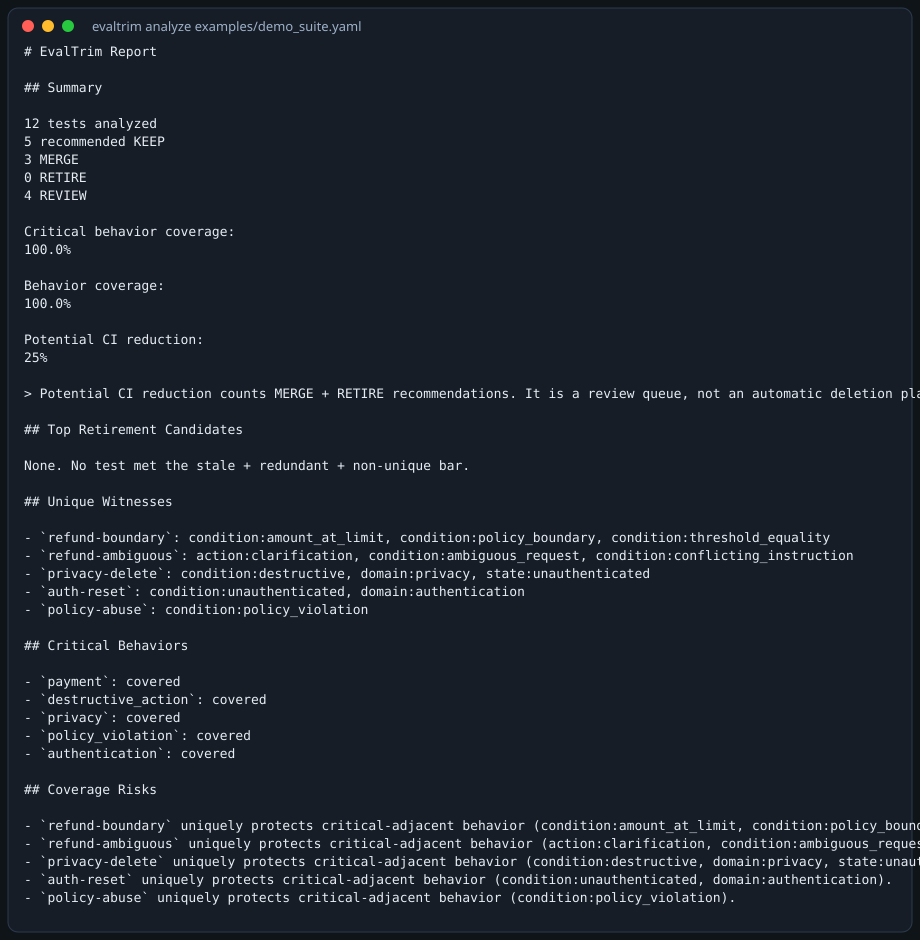
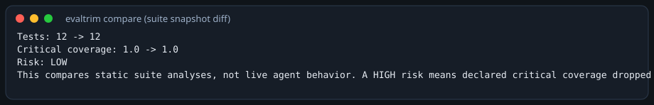
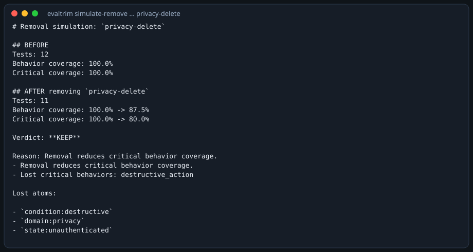
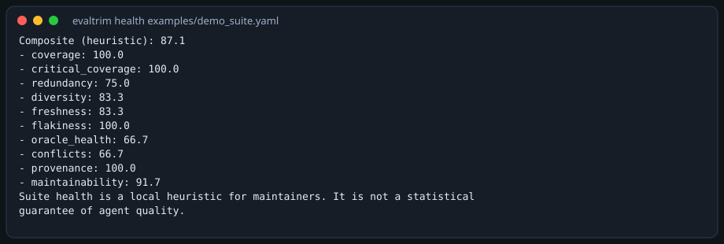
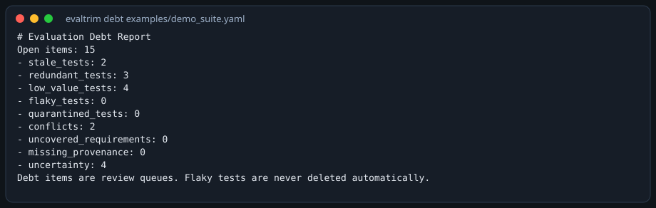
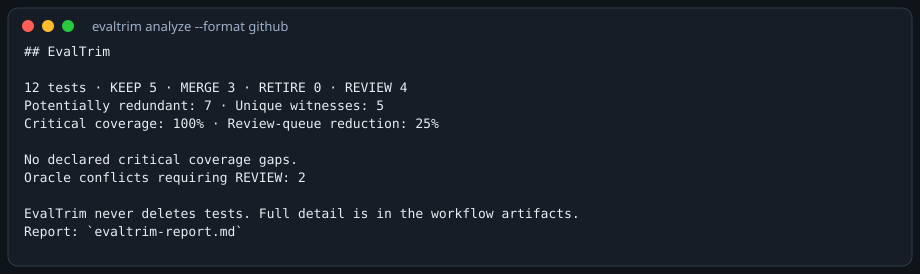

# EvalTrim

## The Evaluation Control Plane for AI Agents

> Run. Replay. Compare. Understand. Optimize.

EvalTrim is a local-first CLI that does three jobs together:

1. **Evaluation** — run graders against a local agent adapter, record/replay, snapshots
2. **Regression Control** — compare runs and suites, classify drift *likely sources*, watch files, select impacted tests
3. **Evaluation Intelligence** — behavior graph, unique witnesses, counterfactual removal, suite health, evaluation debt, portfolio selection

> EvalTrim does not only evaluate your agent. It evaluates and optimizes the evaluation system itself.

It never deletes tests. Recommendations are KEEP / MERGE / RETIRE / REVIEW / ADD_CANDIDATE with a serializable evidence ledger.

**Not included (deferred):** IDE plugins, full MCP, self-healing, automatic code repair, canary/rollback, hosted tracing, SaaS dashboards.

Current version: **0.4.0**

## Quick start

```bash
pip install -e ".[dev]"
evaltrim analyze examples/demo_suite.yaml
evaltrim run examples/demo_suite.yaml --agent echo-expected --dry-run
evaltrim health examples/demo_suite.yaml
evaltrim maintain examples/demo_suite.yaml
```

v0.1/v0.2 commands still work: `validate`, `report`, `simulate-remove`, `benchmark`, `check`, `import-jsonl`, `snapshot`, `compare`, `replay`.

New in v0.3/v0.4: `watch`, `impacted-tests`, `ingest-traces`, `compare-runs`, `ingest-failure`, `flake-report`, `health`, `debt`, `portfolio`.

## Distinctive capability

Semantic retrieval may **create candidates**. It does **not** independently authorize RETIRE. Final safety still depends on behavior overlap, unique witnesses, criticality, boundaries, requirements, counterfactual removal, oracle conflict, and historical failures.

## Screenshots (actual CLI output)

Rendered from real commands via `scripts/generate_demo_screenshots.py`.

### CLI evaluation summary



### Regression comparison



### Unique witness / removal simulation



### Suite health / evaluation debt





### GitHub PR comment



### HTML report

Open [docs/assets/report.html](docs/assets/report.html) (generated by `evaltrim analyze --format html`).

## Measured benchmarks (v0.4.0)

Command: `PYTHONPATH=src python3 -m evaltrim.cli benchmark benchmarks`  
No LLM. Embeddings off. Constructed suites, not production traffic.

| Suite | Precision | Recall | F1 | Retirement safety | Critical coverage | Review-queue reduction |
|---|---|---|---|---|---|---|
| coding_agent | 1.0 | **1.0** | 1.0 | 1.0 | 1.0 | 46% |
| customer_support | 1.0 | **0.875** | 0.93 | 1.0 | 1.0 | 19% |
| shopping_agent | 1.0 | **1.0** | 1.0 | 1.0 | 1.0 | 40% |

Recall before this release (v0.2.0, same harness, smaller suites): coding 0.50, customer_support 0.40, shopping_agent 0.25. Precision stayed 1.0. Safety stayed 1.0.

**Tradeoff:** customer_support wording pair (`parcel is late` vs `parcel arrived late`) is still below the MERGE bar. We did not lower merge confidence to catch it, because that would risk collapsing hard negatives (refund vs refund+store-credit).

### Scale (synthetic suites, no quality labels)

| n | runtime | peak MiB | candidate pairs |
|---|---|---|---|
| 100 | 2.68s | 7.3 | 4950 |
| 500 | 15.09s | 75.5 | 21840 |
| 1000 | 35.69s | 136.5 | 38881 |
| 5000 | 466.7s | 614.7 | 174694 |

10,000 was not run. At 5,000 the bottleneck is **counterfactual removal** (~315s), not candidate generation. Blocking already limits pairs; removal still walks each test.

## CLI map

```text
evaltrim analyze SUITE          # suite intelligence + evidence
evaltrim run SUITE              # local graders
evaltrim compare A B            # suite snapshot diff
evaltrim compare-runs A B       # recorded-run regression classes
evaltrim watch SUITE --once     # debounce file watch
evaltrim impacted-tests SUITE PATHS
evaltrim health / debt / portfolio / maintain
evaltrim ingest-failure / ingest-traces / flake-report
```

## Privacy

Local by default. No telemetry. Optional embeddings are a hashing encoder unless you opt in. See [docs/privacy.md](docs/privacy.md).

## Docs

- [Architecture](docs/architecture.md)
- [Traces](docs/traces.md)
- [Regression](docs/regression.md)
- [Watch / impacted tests](docs/watch.md)
- [Behavior graph & witnesses](docs/behavior-model.md)
- [Removal simulation](docs/removal-simulation.md)
- [Suite health & debt](docs/health.md)
- [GitHub Action](docs/github-action.md)
- [Benchmarks](docs/benchmark.md)
- [Limitations](docs/limitations.md)

## License

[MIT](LICENSE)
